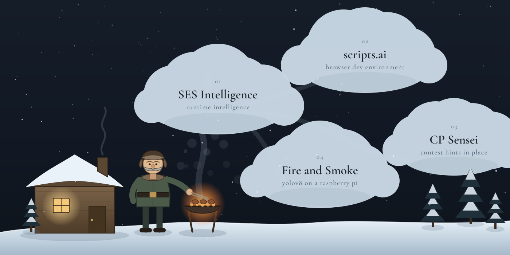
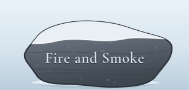
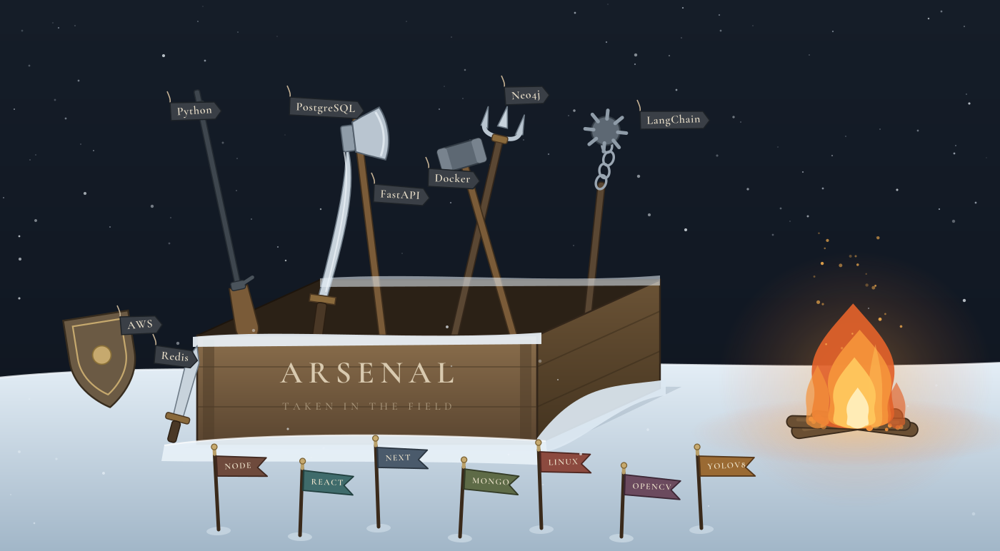

 

 
  

  

 

---

 

---

---

### ACTIVITY

---

[LinkedIn](https://www.linkedin.com/in/aditya-pranjal29/) &nbsp;·&nbsp; [Portfolio](https://pranjalportfolio-ivory.vercel.app/) &nbsp;·&nbsp; [X](https://x.com/notreallyaps_45) &nbsp;·&nbsp; [Instagram](https://www.instagram.com/_pranjal.aditya_) &nbsp;·&nbsp; [Email](mailto:adityapranjal29112001@gmail.com)

