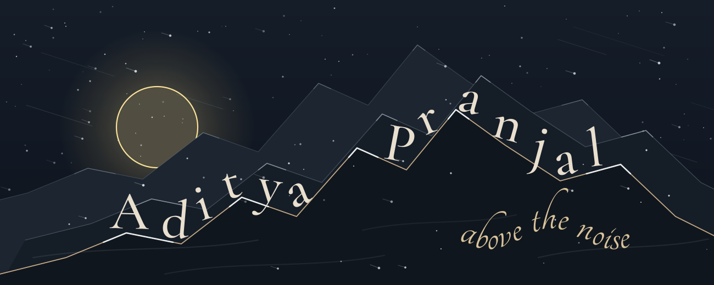
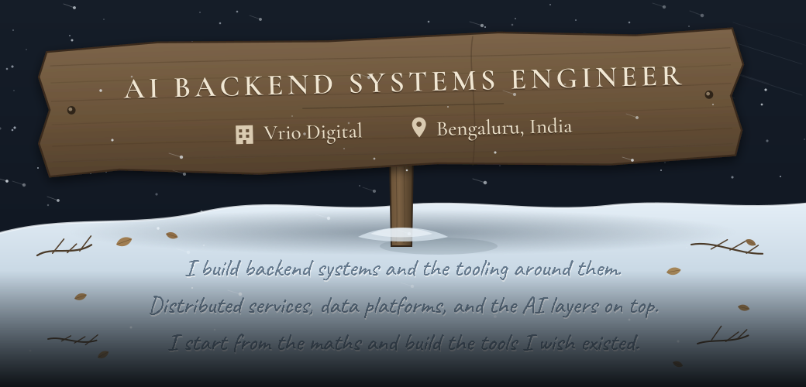
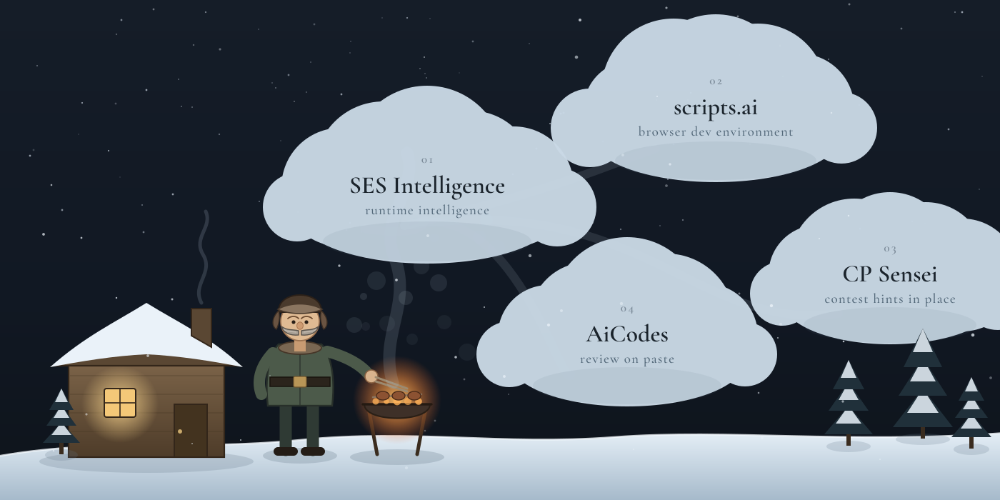

<div align="center">


<br/>


<br/>
<br/><br/>





<br/><br/>


<br/>


</div>

---

### 01  SELECTED WORK

<div align="center">



</div>

<br/>

**01 &nbsp; SES Intelligence**<br/>
Instruments the call graph at runtime, scores it, and names the edge that regressed.<br/>
<sub>[repository](https://github.com/dummy-pranjal29/self-explaining-software) &nbsp;·&nbsp; [live](https://self-explaining-software.onrender.com/) &nbsp;·&nbsp; Python, Django, React</sub>

**02 &nbsp; scripts.ai**<br/>
Node compiled to WebAssembly, filesystem and process table included. The editor ships no backend.<br/>
<sub>[repository](https://github.com/dummy-pranjal29/scripts.ai) &nbsp;·&nbsp; [live](https://scripts-ai-aps.vercel.app/) &nbsp;·&nbsp; TypeScript, Next.js, WebContainers</sub>

**03 &nbsp; CP Sensei**<br/>
Releases one layer of the solution at a time, so the search space stays yours.<br/>
<sub>[repository](https://github.com/dummy-pranjal29/CP-Sensei) &nbsp;·&nbsp; Chrome MV3, Shadow DOM</sub>

**04 &nbsp; AiCodes**<br/>
Gemini reads the paste and answers in Markdown. Serverless, so nothing idles between reviews.<br/>
<sub>[repository](https://github.com/dummy-pranjal29/AiCodes) &nbsp;·&nbsp; [live](https://ai-codes-main-7s8l.vercel.app/) &nbsp;·&nbsp; React, Node, Gemini</sub>

<br/>

---

### 02  TOOLKIT

<div align="center">
<br/>

<br/><br/>
</div>

```go
// somewhere above the treeline, 6:40 AM

for range time.Tick(day) {
        if it.Breaks() {
                understand(it)        // not patch it
        }
        ship(quietly)
}
```

<br/>

---

### 03  ACTIVITY

<div align="center">


&nbsp;


<br/><br/>


<br/><br/>


</div>

<br/>

---

### 04  ELSEWHERE

<div align="center">
<br/>

<a href="https://www.linkedin.com/in/aditya-pranjal29/"></a>
&nbsp;
<a href="https://pranjalportfolio-ivory.vercel.app/"></a>
&nbsp;
<a href="https://x.com/notreallyaps_45"></a>
&nbsp;
<a href="https://www.instagram.com/_pranjal.aditya_"></a>
&nbsp;
<a href="mailto:adityapranjal29112001@gmail.com"></a>

<br/><br/>


</div>
