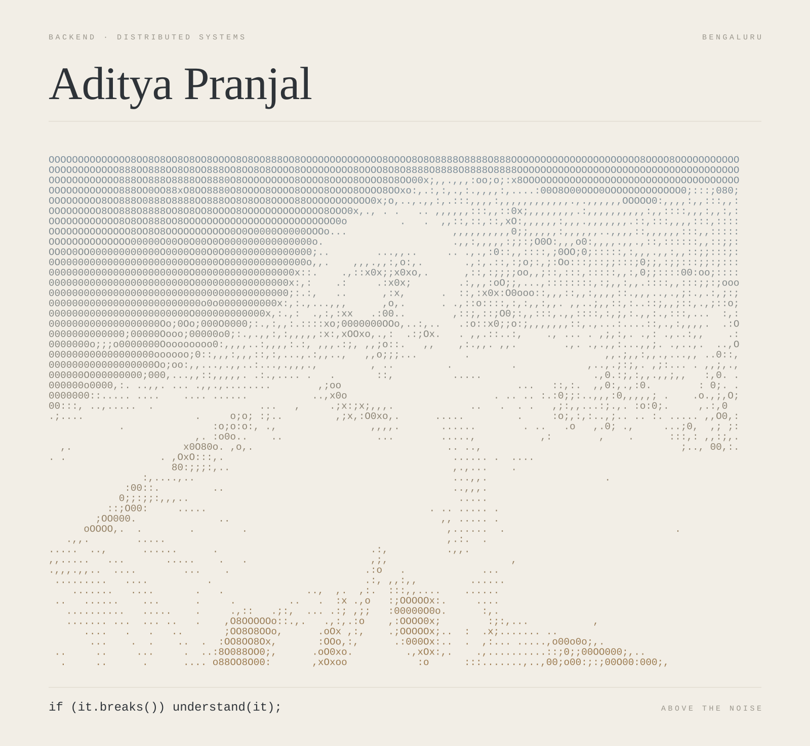

 

### 01 &nbsp; WORK

`01` &nbsp; **SES Intelligence** 
Instruments the call graph at runtime, scores it, and names the edge that regressed. 
[repository](https://github.com/dummy-pranjal29/self-explaining-software) &nbsp;·&nbsp; [live](https://self-explaining-software.onrender.com/) &nbsp;·&nbsp; Python, Django, React

`02` &nbsp; **scripts.ai** 
Node compiled to WebAssembly, filesystem and process table included. The editor ships no backend. 
[repository](https://github.com/dummy-pranjal29/scripts.ai) &nbsp;·&nbsp; [live](https://scripts-ai-aps.vercel.app/) &nbsp;·&nbsp; TypeScript, Next.js, WebContainers

`03` &nbsp; **CP Sensei** 
Releases one layer of the solution at a time, so the search space stays yours. 
[repository](https://github.com/dummy-pranjal29/CP-Sensei) &nbsp;·&nbsp; Chrome MV3, Shadow DOM

`04` &nbsp; **AiCodes** 
Gemini reads the paste and answers in Markdown. Serverless, so nothing idles between reviews. 
[repository](https://github.com/dummy-pranjal29/AiCodes) &nbsp;·&nbsp; [live](https://ai-codes-main-7s8l.vercel.app/) &nbsp;·&nbsp; React, Node, Gemini

 

### 02 &nbsp; STACK

Go &nbsp;·&nbsp; Python &nbsp;·&nbsp; Node &nbsp;·&nbsp; Java &nbsp;·&nbsp; Postgres &nbsp;·&nbsp; Redis &nbsp;·&nbsp; Kafka &nbsp;·&nbsp; Docker &nbsp;·&nbsp; Kubernetes &nbsp;·&nbsp; AWS &nbsp;·&nbsp; Linux

 

### 03 &nbsp; ELSEWHERE

[LinkedIn](https://www.linkedin.com/in/aditya-pranjal29/) &nbsp;·&nbsp; [Portfolio](https://pranjalportfolio-ivory.vercel.app/) &nbsp;·&nbsp; [X](https://x.com/notreallyaps_45) &nbsp;·&nbsp; [Instagram](https://www.instagram.com/_pranjal.aditya_) &nbsp;·&nbsp; [Email](mailto:adityapranjal29112001@gmail.com)
