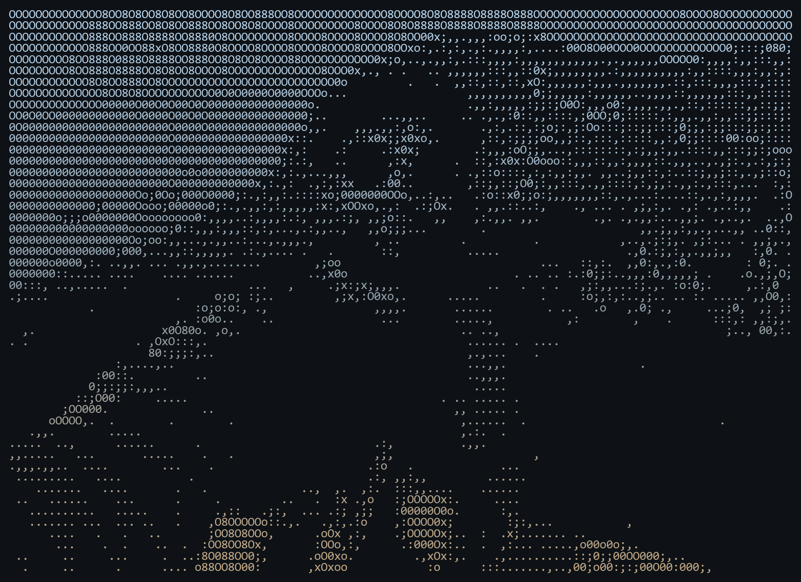

<div align="center">


<br/>



<br/>
<sub><i>above the noise</i></sub>
<br/><br/>


<sub>B A C K E N D &nbsp;&middot;&nbsp; D I S T R I B U T E D &nbsp; S Y S T E M S &nbsp;&middot;&nbsp; B E N G A L U R U</sub>

<br/><br/>


<br/>


</div>

<br/>

<div align="center">
<i>I build backend systems and the tooling around them.<br/>
The part I actually like happens away from the noise — a problem held long<br/>
enough to be understood, then a system that runs quietly afterwards.</i>
</div>

<br/>

---

### 01 &nbsp;—&nbsp; SELECTED WORK

<table>
<tr>
<td width="50%" valign="top">

**SES INTELLIGENCE**

<sub>RUNTIME INTELLIGENCE &nbsp;·&nbsp; PYTHON, DJANGO, REACT</sub>

Software that watches itself. Builds architecture graphs from live function
calls, scores health, and flags degradation before it surfaces.

Published to PyPI. Django REST API, React dashboard, full CI/CD.

<sub>[repository](https://github.com/dummy-pranjal29/self-explaining-software) &nbsp;·&nbsp; [live](https://self-explaining-software.onrender.com/)</sub>

</td>
<td width="50%" valign="top">

**SCRIPTS.AI**

<sub>BROWSER DEV ENVIRONMENT &nbsp;·&nbsp; TYPESCRIPT, NEXT.JS, PRISMA</sub>

A full development environment that never leaves the tab. Monaco editor,
live preview and a real terminal, all on WebContainers.

Groq-backed assistance, role-based auth, multi-language.

<sub>[repository](https://github.com/dummy-pranjal29/scripts.ai) &nbsp;·&nbsp; [live](https://scripts-ai-aps.vercel.app/)</sub>

</td>
</tr>
<tr>
<td width="50%" valign="top">

**CP SENSEI**

<sub>BROWSER EXTENSION &nbsp;·&nbsp; CHROME MV3, SHADOW DOM</sub>

Hints without leaving the problem. Starts with the topic, goes one layer
deeper each time you ask, stops where you want it to.

Reads the verdict after submission and points at where it went wrong.

<sub>[repository](https://github.com/dummy-pranjal29/CP-Sensei)</sub>

</td>
<td width="50%" valign="top">

**AICODES**

<sub>CODE REVIEW &nbsp;·&nbsp; REACT, NODE.JS, GEMINI</sub>

Paste code, get a review. Markdown output with syntax highlighting,
served by Gemini 2.0 Flash.

Serverless functions on Vercel — no servers to keep alive.

<sub>[repository](https://github.com/dummy-pranjal29/AiCodes) &nbsp;·&nbsp; [live](https://ai-codes-main-7s8l.vercel.app/)</sub>

</td>
</tr>
</table>

<br/>

---

### 02 &nbsp;—&nbsp; TOOLKIT

<div align="center">
<br/>

<br/><br/>
</div>

```go
// somewhere above the treeline, 6:40 AM

for range time.Tick(day) {
        if it.Breaks() {
                understand(it)        // not patch it
        }
        ship(quietly)
}
```

<br/>

---

### 03 &nbsp;—&nbsp; ACTIVITY

<div align="center">


&nbsp;


<br/><br/>


<br/><br/>


</div>

<br/>

---

### 04 &nbsp;—&nbsp; ELSEWHERE

<div align="center">
<br/>

<a href="https://www.linkedin.com/in/aditya-pranjal29/"></a>
&nbsp;
<a href="https://pranjalportfolio-ivory.vercel.app/"></a>
&nbsp;
<a href="https://x.com/notreallyaps_45"></a>
&nbsp;
<a href="https://www.instagram.com/_pranjal.aditya_"></a>
&nbsp;
<a href="mailto:adityapranjal29112001@gmail.com"></a>

<br/><br/>


</div>
