

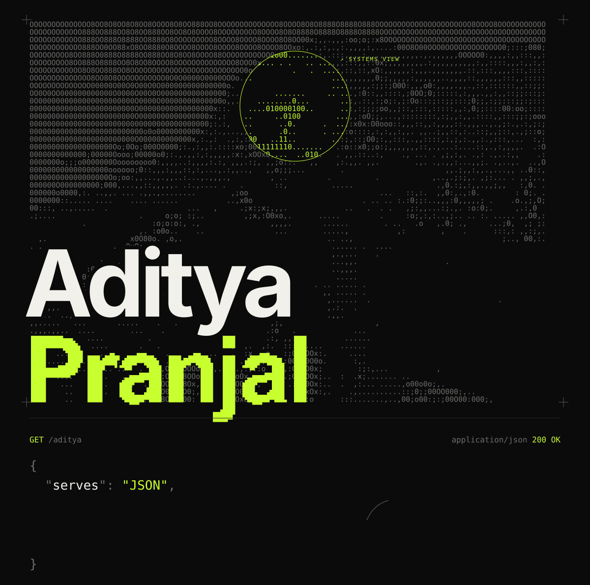

    

<a href="https://github.com/dummy-pranjal29/self-explaining-software">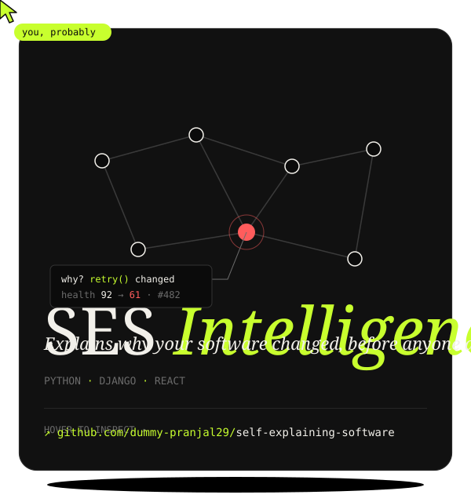</a> <a href="https://github.com/dummy-pranjal29/scripts.ai">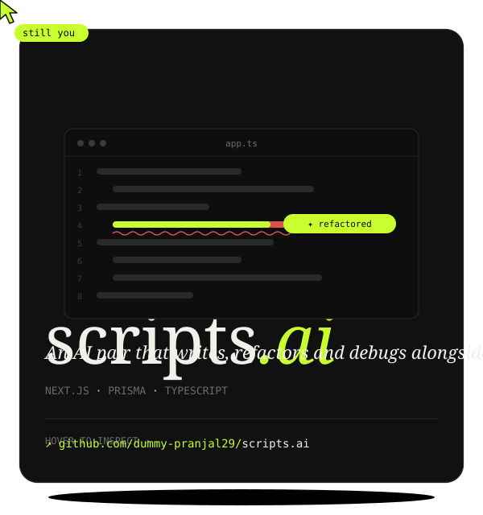</a>
<a href="https://github.com/dummy-pranjal29/CP-Sensei">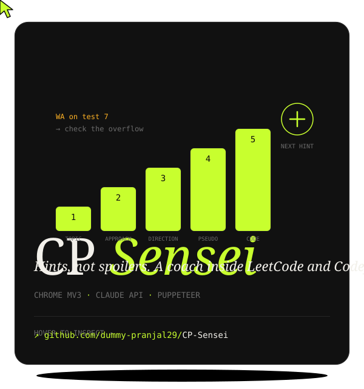</a> <a href="https://github.com/dummy-pranjal29/fire-smoke-detection">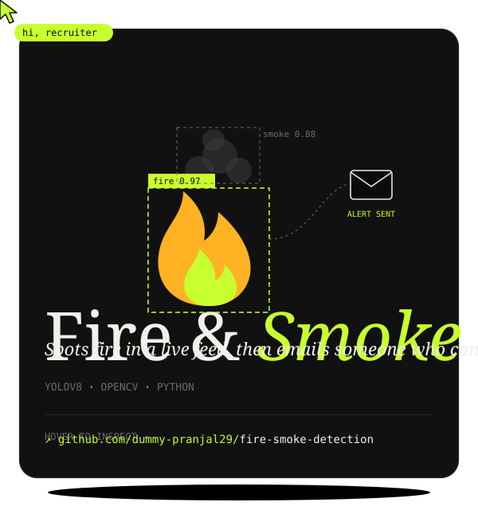</a>

    

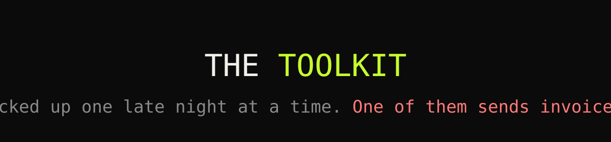
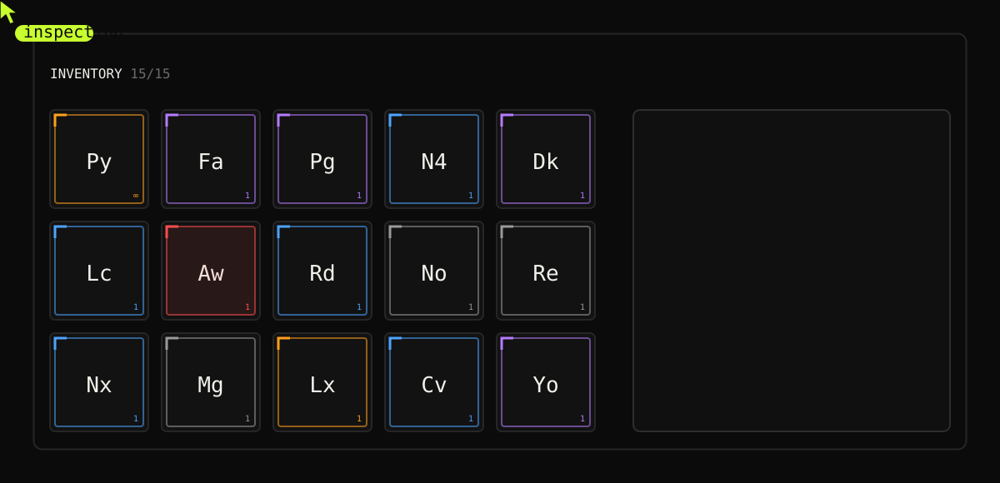

    

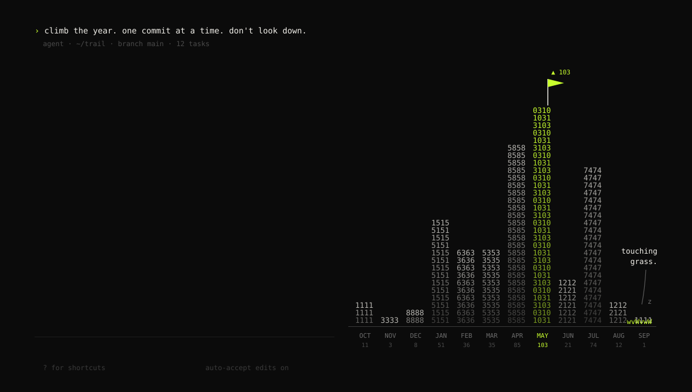

    

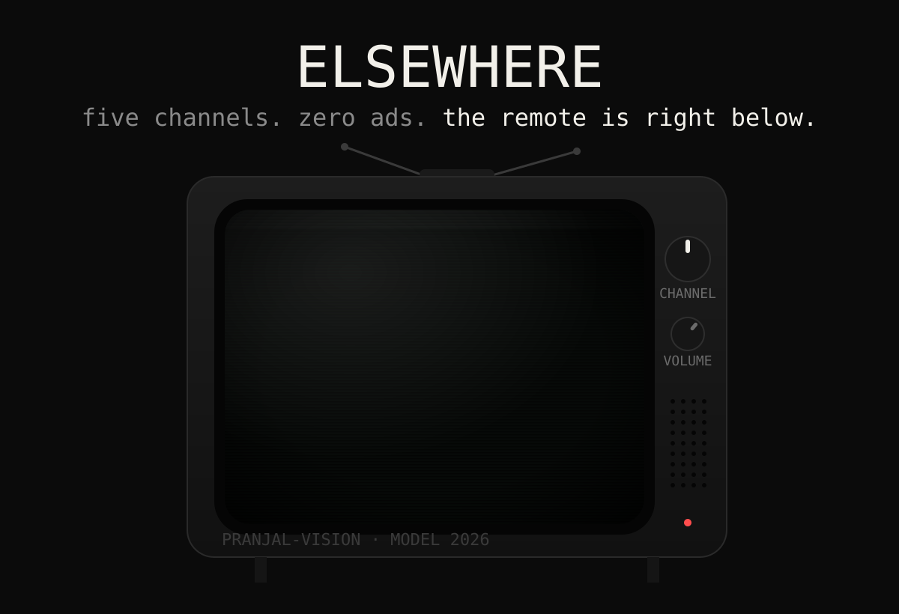
<a href="https://www.linkedin.com/in/aditya-pranjal29/">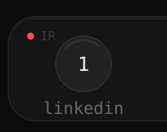</a><a href="https://pranjalportfolio-ivory.vercel.app/">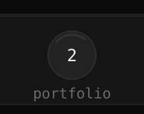</a><a href="https://x.com/notreallyaps_45">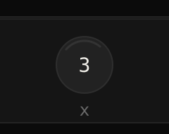</a><a href="https://www.instagram.com/_pranjal.aditya_">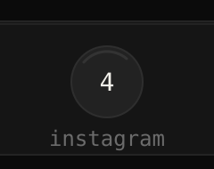</a><a href="mailto:adityapranjal29112001@gmail.com">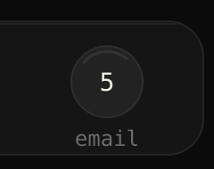</a>

  

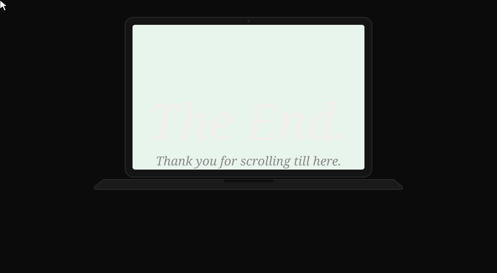

